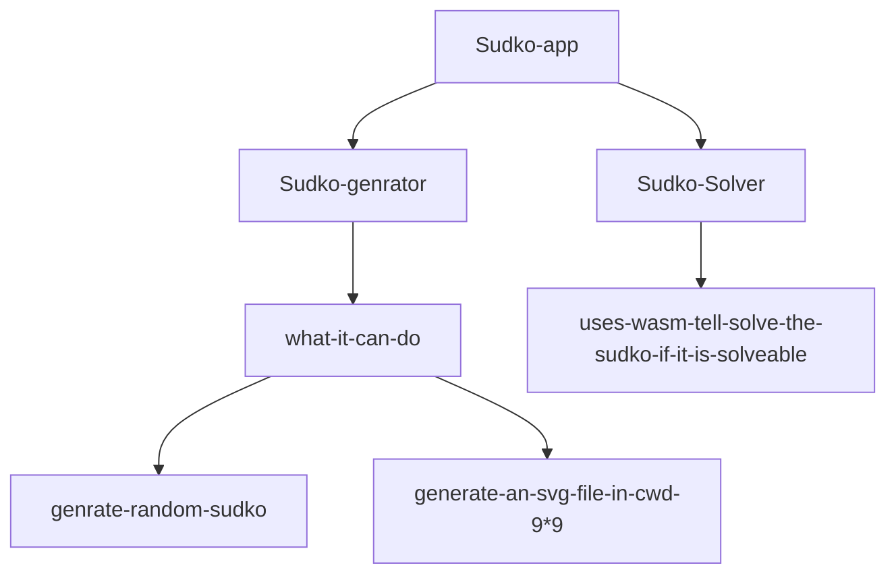

# PROJECT_SUDKO_WASM



> TO RUN SUDKO-GENERATOR RUN
> 

```markdown
from cwd as sudko-generator
bash setup.sh
now u can run sudkoGen from anywhere after restarting the terminal
```

> TO RUN SUDKO_SOLVER from sudko-solver as cwd
> 

```markdown
./build.sh

```

In case its not working just run 

```markdown
emcc --bind -o public/sudoku-solver.js src/wasm-bindings.cc src/solver.cc src/grid.cc -s NO_DISABLE_EXCEPTION_CATCHING -O3
```

from the terminal

> u need to have wasm , g++ ,cmake ,installed
> 

now to run the sudko_solver_int_web

uses

```markdown
python3 -m http.server
```

[Screenca[clip2.webm](https://user-images.githubusercontent.com/107099010/185517057-742786b8-914c-4aec-804f-fd1c76068e7f.webm)
st from 19[clip1.webm](https://user-images.githubusercontent.com/107099010/185517046-64c6a86c-0215-4b0e-a733-af1c50a04dfa.webm)
-08-22 05:15:31 AM IST.webm](PROJECT_SUDKO_WASM%20205d0738a0fe4d589acbdacb397b0d9c/Screencast_from_19-08-22_051531_AM_IST.webm)

[Screencast from 19-08-22 05:17:26 AM IST.webm](PROJECT_SUDKO_WASM%20205d0738a0fe4d589acbdacb397b0d9c/Screencast_from_19-08-22_051726_AM_IST.webm)
