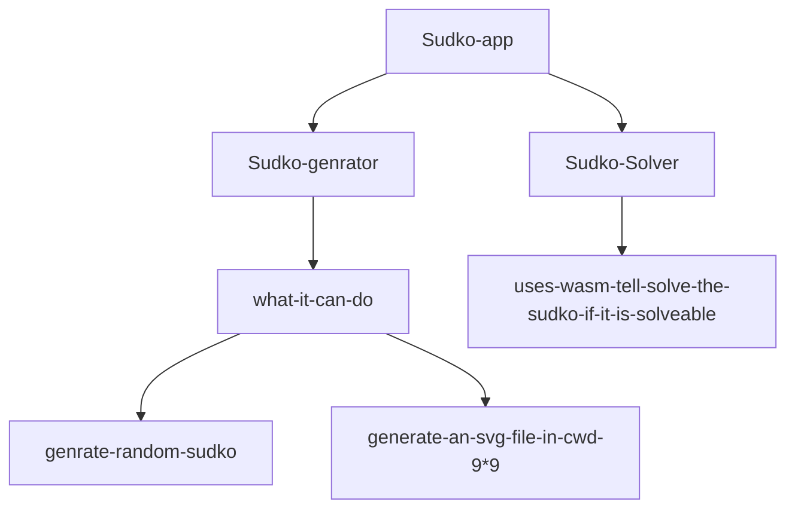

# PROJECT_SUDKO_WASM



> TO RUN SUDKO-GENERATOR RUN
> 

```markdown
from cwd as sudko-generator
bash setup.sh
now u can run sudkoGen from anywhere after restarting the terminal
```

> TO RUN SUDKO_SOLVER from sudko-solver as cwd
> 

```markdown
./build.sh

```

In case its not working just run 

```markdown
emcc --bind -o public/sudoku-solver.js src/wasm-bindings.cc src/solver.cc src/grid.cc -s NO_DISABLE_EXCEPTION_CATCHING -O3
```

from the terminal

> u need to have wasm , g++ ,cmake ,installed
> 

now to run the sudko_solver_int_web

uses

```markdown
python3 -m http.server
```[clipl.webm](https://user-images.githubusercontent.com/107099010/185517200-cfee0f28-628b-4941-9e12-4cef610c0d7c.webm)

[clipr.webm](https://user-images.githubusercontent.com/107099010/185517203-8389f111-4715-4f6c-98ca-6d5dc5ac30ee.webm)

